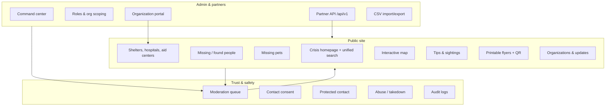
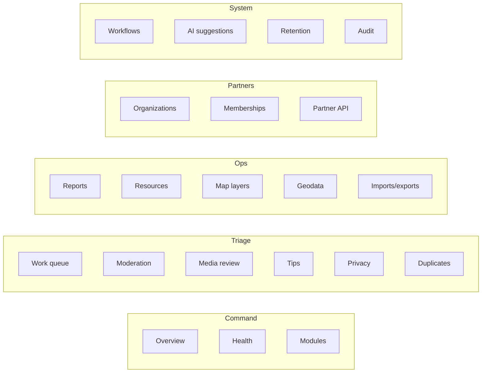
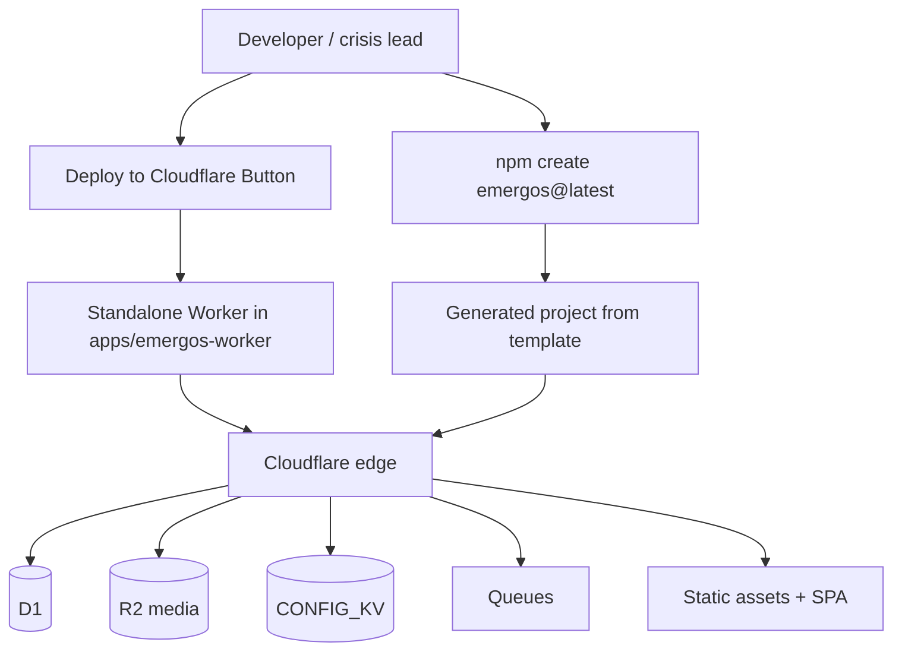
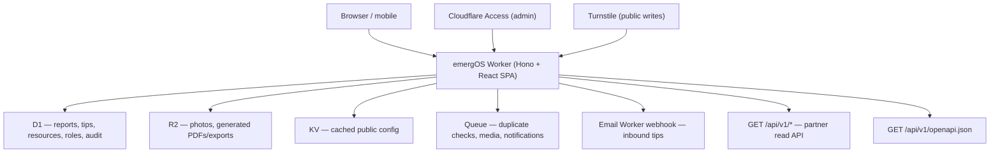
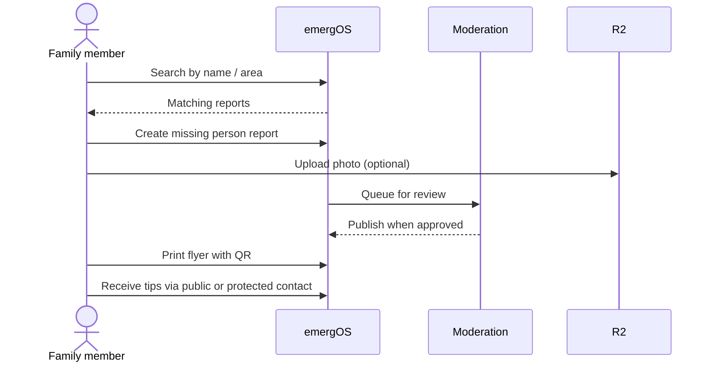
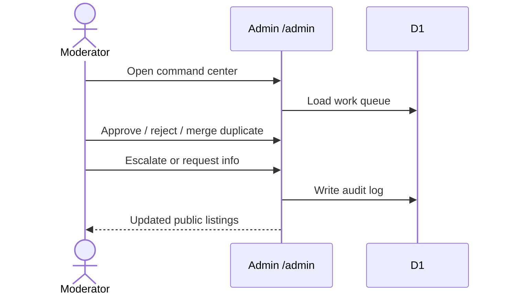

# emergOS

**Deploy a crowdsourced crisis management platform in under a minute** when tragedy strikes: earthquakes, floods, hurricanes, wildfires, conflict, displacement, and other humanitarian emergencies.

**emergOS** is an open-source, Cloudflare-native starter for that moment: one-click or CLI setup, then a live site where communities can coordinate missing-person searches, found-person reports, tips, shelters, hospitals, aid points, and volunteer efforts — with moderation built in from day one.

This is **not** a replacement for official emergency services. It is a fast coordination layer for volunteers, NGOs, and civil society when official systems are slow, fragmented, or hard to reach.

| | |
|---|---|
| **PRD** | [`emergos-prd.md`](./emergos-prd.md) (v0.1 draft) |
| **Status tracker** | [`docs/prd-status.md`](./docs/prd-status.md) |
| **Version** | 0.1.0 MVP |

---

## What is built (MVP)

The first implementation is a self-contained Cloudflare Worker app in `apps/emergos-worker`, plus a `create-emergos` CLI for generating configured standalone starters.



### Public modules

| Module | Routes | Status |
|---|---|---|
| Crisis homepage | `/` | Done — actions and search first, no marketing hero |
| Unified search | `/search` | Done — reports, resources, updates, organizations |
| Missing / found people | `/reports`, `/reports/:slug` | Done — photo upload, status, tips, flyers |
| Missing pets | `/pets` | Done — dedicated module and pet flyers |
| Resources directory | `/resources` | Done — shelters, hospitals, aid centers, volunteers |
| Map | `/map` | Done — layer toggles, list fallback in crisis mode |
| Tips | `/tips/new` | Done — general and case-specific |
| Organizations | `/organizations` | Done — verified org pages + apply flow |
| Public updates | `/updates` | Done |
| Reporter self-service | `/reports/:slug/manage` | Done — safe updates; sensitive changes go to moderation |
| Privacy / data requests | `/data-request` | Done |
| PWA shell | manifest + service worker | Partial — offline cache exists; install QA deferred |

### Admin command center

Grouped operations navigation at `/admin`:



Capabilities include moderation, duplicate handling, role assignment, organization memberships, crisis-mode controls, retention policy preview/run, generated flyer/resource PDFs, privacy-request exports, inbound email-tip ingestion, notification event queue, workflow run tracking, semantic-search fallback, and AI suggestion fallbacks (human review required).

### Deployment paths

Two complementary ways to ship a crisis site:



---

## Architecture



**Stack:** Cloudflare Workers, D1, R2, KV, Queues, Assets, Turnstile, Hono, React, Vite, Wrangler.

Optional flags in `wrangler.jsonc`: `ENABLE_WORKERS_AI`, `ENABLE_VECTORIZE`, `ENABLE_PWA`. When disabled, heuristic fallbacks still power admin suggestions and semantic search locally.

---

## Repository layout

```
emergOS/
├── apps/emergos-worker/     # Main deployable Worker + React app
├── cli/create-emergos/      # npm CLI and packaged template
├── examples/earthquake-ve/  # Sample emergos.config.ts
├── emergos-landing-worker/  # Marketing landing page Worker
├── docs/                    # Deployment, moderation, privacy, API, status
└── emergos-prd.md           # Product requirements (draft)
```

---

## Quick start (monorepo)

```bash
pnpm install
pnpm --filter @emergos/worker types:worker
pnpm --filter @emergos/worker db:migrations:apply:local
pnpm dev
```

For local form submissions without Turnstile:

```bash
cp apps/emergos-worker/.dev.vars.example apps/emergos-worker/.dev.vars
# set BYPASS_TURNSTILE=true
```

Open the dev server URL printed by Vite (typically `http://localhost:5173`).

---

## Create a standalone project

```bash
npm create emergos@latest my-response -- \
  --profile earthquake \
  --country VE \
  --locale es-VE \
  --deployment cloudflare

cd my-response
pnpm install
cp .dev.vars.example .dev.vars
pnpm db:migrations:apply:local
pnpm dev
```

**Profiles:** `earthquake`, `flood`, `hurricane`, `wildfire`, `conflict`, `multi`.

The generator writes crisis defaults, rewrites `wrangler.jsonc`, packages the Worker template, and prints Cloudflare setup steps. Generated starters do not depend on the monorepo.

---

## Deploy

The Worker app is [Deploy Button](https://developers.cloudflare.com/workers/platform/deploy-button/) compatible.

```bash
cd apps/emergos-worker
pnpm build
pnpm db:migrations:apply
pnpm deploy
```

[](https://deploy.workers.cloudflare.com/?url=https://github.com/emergos/emergos/tree/main/apps/emergos-worker)

### Required Cloudflare bindings

| Binding | Purpose |
|---|---|
| `DB` | D1 — schema via `migrations/` |
| `MEDIA` | R2 — report/tip photos, generated files |
| `CONFIG_KV` | KV — cached public configuration |
| `JOBS` | Queue — background processing |

### Secrets

```bash
wrangler secret put TURNSTILE_SECRET_KEY
wrangler secret put SESSION_SECRET
```

Replace placeholder D1/KV IDs in `wrangler.jsonc` before production deploy. See [`docs/deployment.md`](./docs/deployment.md).

---

## Key user flows

### Family member searching for someone



### Volunteer moderation



---

## Trust, safety, and privacy

- **Contact consent** — public phone/email/WhatsApp requires explicit opt-in; may appear on flyers and shared links.
- **Protected contact** — messages route through moderation instead of exposing reporter details.
- **Verification labels** — community vs contact-verified vs organization-verified (not implied official).
- **Turnstile** — server-side validation on public writes (bypass locally via `.dev.vars`).
- **Abuse / takedown** — public requests enter the moderation queue.
- **Retention** — admin-configurable policies with preview and cleanup runs.
- **Crisis mode** — low-bandwidth behavior (e.g. map fallback to lists).

Details: [`docs/moderation.md`](./docs/moderation.md), [`docs/privacy.md`](./docs/privacy.md).

---

## Partner API

Token-scoped read API for trusted integrations. Create tokens in **Admin → Partner API**.

- OpenAPI: `GET /api/v1/openapi.json`
- Scopes: `reports:read`, `pets:read`, `resources:read`, `organizations:read`, `updates:read`, `map:read`

Full reference: [`docs/public-api.md`](./docs/public-api.md).

---

## Internationalization

English and Spanish UI dictionaries ship today. Admin can override locale packs; public endpoint serves active copy. Country-specific Spanish variants (`es-VE`, `es-AR`, etc.) are supported via configuration — full copy QA is release work.

---

## Development

```bash
pnpm typecheck          # Worker + CLI
pnpm test               # Vitest (Worker unit tests)
pnpm build              # Worker production build + CLI
pnpm release:check      # typecheck + test + build + deploy dry-run
```

Release checklist: [`docs/release-checklist.md`](./docs/release-checklist.md).

---

## Implementation status vs PRD

Aligned with [`docs/prd-status.md`](./docs/prd-status.md) (updated 2026-06-29).

| Area | Status |
|---|---|
| Worker app, D1 schema, R2 uploads | Done |
| Public modules (search, map, pets, flyers, resources) | Done |
| Moderation, roles, org portal, partner API | Done |
| Reporter self-service, retention, crisis mode | Done |
| `create-emergos` CLI | Done |
| Turnstile, EN/ES i18n | Done |
| Deploy Button starter | Partial — needs external verification on clean account |
| Email ingestion | Partial — inbound tips; outbound delivery deferred |
| Notifications (email/SMS/WhatsApp) | Partial — queue + admin UI; provider adapters deferred |
| Workflows | Partial — run records + queue; native Workflows binding deferred |
| Workers AI / Vectorize | Partial — admin endpoints with local fallbacks |
| PWA / offline | Partial — shell exists; field QA deferred |
| Tests | Partial — unit + release check; E2E/a11y expansion needed |

### Deferred roadmap

- Native Cloudflare Workflows for verification, onboarding, imports, reminders, retention
- Provider-backed outbound email, SMS, and WhatsApp
- Production Workers AI and Vectorize bindings
- Full offline PWA QA and richer PDF print layouts
- External error tracking and deeper analytics
- E2E, accessibility, and generated-starter smoke tests

---

## Documentation

| Doc | Description |
|---|---|
| [`emergos-prd.md`](./emergos-prd.md) | Full product requirements |
| [`docs/prd-status.md`](./docs/prd-status.md) | Feature-by-feature implementation tracker |
| [`docs/deployment.md`](./docs/deployment.md) | Bindings, secrets, Deploy Button notes |
| [`docs/public-api.md`](./docs/public-api.md) | Partner API reference |
| [`docs/moderation.md`](./docs/moderation.md) | Moderation workflows |
| [`docs/privacy.md`](./docs/privacy.md) | Privacy and consent model |
| [`docs/release-checklist.md`](./docs/release-checklist.md) | Pre-release verification |

---

## Brand

Primary color `#C91525` on white. Mobile-first, low-bandwidth, print-aware. The first screen is the emergency interface — not a marketing landing page.
