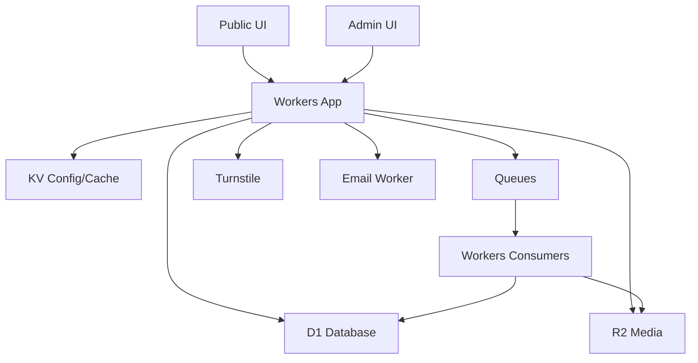
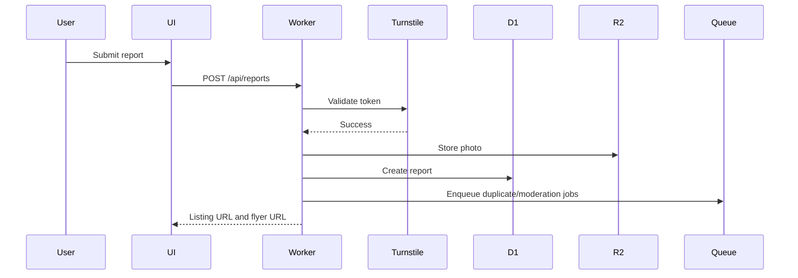
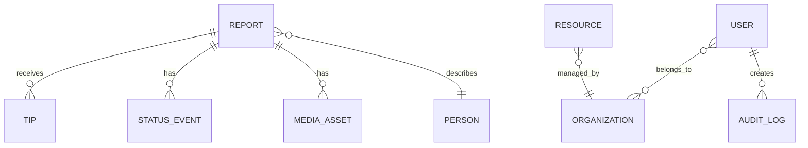

# emergOS Product Requirements Document

Version: 0.1  
Date: 2026-06-27  
Status: Draft PRD  
Default language: English  
Primary brand color: `#C91525`  
Background: `#FFFFFF`

## 1. Executive Summary

`emergOS` is an open-source, Cloudflare-native crisis information and reunification platform that can be deployed quickly during earthquakes, floods, hurricanes, wildfires, conflict, displacement, infrastructure failures, public health emergencies, and other humanitarian crises.

The core use case is simple and urgent: help people find missing loved ones, report found people or pets, share verified updates, print search flyers with QR codes, and coordinate resources such as shelters, hospitals, aid collection points, volunteers, emergency services, and trusted organizations.

The product should be deployable in two complementary ways:

1. **Deploy to Cloudflare Button**
   A one-click deployment path for public GitHub/GitLab repositories using Cloudflare Workers.

2. **npm CLI generator**
   A fast setup tool for creating a configured emergency site based on disaster type, country, locale, and enabled modules.

Example:

```bash
npx create-emergos@latest --profile earthquake --country VE --locale es-VE
npx create-emergos@latest --profile flood --country DE --locale de-DE
npx create-emergos@latest --profile conflict --country UA --locale uk-UA
```

`emergOS` should not try to replace official emergency services. It should act as a fast, trustworthy, locally configurable crisis coordination layer that communities, volunteers, NGOs, journalists, local governments, and civil society groups can deploy when official systems are incomplete, slow, offline, fragmented, or hard to access.

## 2. Problem Statement

After major crises, information often fragments across social media posts, WhatsApp groups, spreadsheets, local news articles, unofficial maps, government PDFs, and volunteer-run websites. This creates several problems:

- Families cannot easily register or search for missing people.
- Duplicate reports spread quickly and become hard to reconcile.
- People may not know which shelters, hospitals, collection points, or volunteer groups are real and active.
- Offline search efforts need printable materials, but online reports are not designed for flyers.
- Communities need local language support immediately.
- Trust and safety risks grow quickly: scams, false reports, harassment, doxxing, political manipulation, and people falsely marked dead.
- Small volunteer teams need moderation tools, verification workflows, and audit trails from day one.
- Disaster sites are often built from scratch under pressure and are hard to reuse for future emergencies.

`emergOS` solves this by offering a reusable emergency platform with configurable crisis profiles, sensible default modules, strong moderation, printable outputs, low-bandwidth design, localization, and a Cloudflare-first deployment model.

## 3. Vision

Build the default open-source emergency information operating system for communities in crisis.

In the first hour after deployment, a team should be able to:

- Configure the affected country, region, language, and emergency profile.
- Publish a public site.
- Accept missing person and missing pet reports.
- Publish shelters, hospitals, emergency contacts, and aid collection points.
- Print flyers with QR codes.
- Moderate reports.
- Receive tips.
- Mark people as safe, found, verified, duplicated, or removed.

In the first day, the team should be able to:

- Onboard moderators and verified organizations.
- Import or seed administrative regions and cities.
- Add multilingual content.
- Create public maps and lists.
- Export data for trusted partners.
- Publish verified updates and emergency instructions.

In the first week, the platform should support:

- Higher traffic.
- Stronger verification workflows.
- Abuse monitoring.
- Data retention policies.
- Public API integrations.
- Localized modules for the specific crisis.

## 4. Goals

- Provide a deployable crisis response starter that works across emergency types.
- Make missing people and family reunification a core module.
- Support missing pets, shelters, hospitals, aid centers, volunteer coordination, emergency contacts, maps, and organization pages.
- Allow fast deployment through Cloudflare Deploy Button.
- Provide an npm CLI generator for tailored deployments.
- Use Cloudflare Workers, D1, R2, KV, Queues, Workflows, Email Service, Turnstile, Images, Durable Objects where justified, and Workers AI/Vectorize where useful.
- Support English by default and localization into many locales, including country-specific Spanish variants such as `es`, `es-ES`, `es-AR`, `es-MX`, `es-VE`.
- Support low-bandwidth, mobile-first, printable, and accessible UX.
- Provide trust and safety controls from the beginning.
- Make the project reusable for future crises without forking the app.

## 5. Non-Goals

- Do not replace police, fire, ambulance, civil defense, hospitals, Red Cross/Red Crescent, UN agencies, or official emergency systems.
- Do not provide medical, legal, or security advice as authoritative guidance unless content is published by verified organizations.
- Do not create a surveillance platform.
- Do not publish sensitive data without explicit consent or verified operational need.
- Do not expose private family information, home addresses, identity numbers, medical records, or exact shelter locations by default.
- Do not depend on a single third-party SaaS that prevents self-hosting.
- Do not require a complex cloud setup for basic deployment.

## 6. Target Users and Personas

### 6.1 Family Member Searching for Someone

Needs:

- Create a missing person report quickly.
- Add photo, name, age, last seen area, clothing, notes, and contact method.
- Print a flyer.
- Receive tips.
- Update the person as safe, found, or still missing.

Constraints:

- May be panicked, tired, displaced, or on a poor mobile connection.
- May not understand privacy implications.
- May prefer WhatsApp or phone over email.

### 6.2 Person With Information

Needs:

- Search for someone.
- Submit a tip, sighting, photo, shelter/hospital information, or correction.
- Contact the reporter directly if allowed.
- Avoid creating an account.

Constraints:

- May only have a few seconds.
- May have weak connectivity.
- May be afraid to reveal identity.

### 6.3 Volunteer Moderator

Needs:

- Review incoming reports.
- Merge duplicates.
- Remove abusive or unsafe content.
- Verify contact information.
- Escalate reports to trusted organizations.
- Leave audit notes.

Constraints:

- High volume.
- Emotional pressure.
- Limited training.

### 6.4 Verified Organization

Examples:

- Local NGO
- Shelter
- Hospital
- Civil defense group
- Municipal office
- Animal rescue
- Community kitchen
- Volunteer coordination group

Needs:

- Publish verified resources.
- Manage an organization page.
- Update availability, capacity, address, hours, and contact information.
- Verify or comment on reports.

### 6.5 Site Owner / Crisis Lead

Needs:

- Deploy quickly.
- Configure country, region, language, branding, modules, and emergency type.
- Manage roles.
- Export data.
- Set retention and takedown policies.
- Transfer ownership to a trusted institution if needed.

### 6.6 Journalist / Public Information Officer

Needs:

- Access verified public updates.
- Find official resources.
- Avoid amplifying unverified missing person or death reports.
- Link to public listings responsibly.

### 6.7 Developer / Maintainer

Needs:

- Deploy and customize with minimal setup.
- Add modules.
- Localize content.
- Run tests and migrations.
- Contribute upstream.

## 7. Branding and Design System

### 7.1 Brand Direction

`emergOS` should feel urgent, credible, calm, and practical. It should avoid the visual language of a marketing startup landing page. The first screen should be the usable emergency interface.

Brand principles:

- Fast to understand.
- Clear hierarchy.
- Minimal decoration.
- High contrast.
- Accessible typography.
- Mobile-first.
- Print-aware.
- Trustworthy without feeling governmental by default.

### 7.2 Color Palette

Primary:

- Emergency red: `#C91525`
- Background: `#FFFFFF`
- Text: `#111827`
- Muted text: `#4B5563`
- Border: `#E5E7EB`
- Light red background: `#FEF2F2`
- Dark red hover: `#A8121F`
- Success: `#15803D`
- Warning: `#B45309`
- Info: `#0369A1`
- Critical: `#7F1D1D`

Notes:

- Use `#C91525` for primary buttons, alert bars, status accents, icons, and large text.
- For small text on red backgrounds, verify contrast. Prefer white text on darker red `#A8121F` if needed.
- Do not use decorative gradients or abstract hero visuals.
- Avoid dark-mode-first design. Dark mode can be added later, but the default should be white.

### 7.3 Typography

Use a system sans-serif stack:

```css
font-family:
  Inter,
  ui-sans-serif,
  system-ui,
  -apple-system,
  BlinkMacSystemFont,
  "Segoe UI",
  sans-serif;
```

Typography should prioritize scannability:

- Page titles: 28-36px
- Section titles: 20-24px
- Body: 16px
- Dense admin tables: 14px
- Avoid letter spacing except for small labels if needed.

### 7.4 UI Style

Use a shadcn-style component system:

- Tailwind CSS tokens.
- Radix UI primitives.
- Cards only for repeated items, not every section.
- Buttons, badges, inputs, selects, dialogs, drawers, tables, tabs, tooltips.
- Clean borders and small radius, preferably 6-8px.
- No heavy shadows.
- No decorative blobs or abstract backgrounds.

### 7.5 First View Requirements

The homepage should immediately show crisis actions:

- Search missing people
- Report missing person
- Report found person
- Find shelters/resources
- Submit tip
- Emergency contacts

No generic marketing hero should appear before the emergency tools.

Example first screen:

```txt
emergOS Venezuela Earthquake Response

[Search name, city, shelter, hospital...]

[Report missing person] [I found someone] [Submit a tip]

Current modules:
Missing people | Shelters | Hospitals | Aid centers | Missing pets | Volunteers
```

## 8. Product Principles

### 8.1 Missing People Is Core

Missing people and family reunification should be available in almost every emergency profile. Language and workflows change by context, but the underlying module remains central.

Examples:

- Earthquake: "Missing person"
- Flood: "Missing or needs rescue"
- Conflict: "Family tracing"
- Displacement: "Reunification request"
- Hospital crisis: "Looking for patient"

### 8.2 Privacy Should Not Block Urgent Contact

Privacy-first does not mean contact-hidden. It means consent-based, risk-aware contact visibility.

Reporters can choose whether to show a public phone number, WhatsApp number, email, or organization contact. Public contact must require explicit confirmation because phone numbers and email addresses are personal data. The UI must clearly explain that public contact details may appear online, in printed flyers, QR pages, and shared links.

Recommended contact modes:

1. **Public direct contact**
   Best for urgent missing person cases, printed flyers, rescue requests, and low-connectivity situations.

2. **Protected contact form**
   Best when harassment, scams, political risk, or doxxing risk is high.

3. **Organization-mediated contact**
   Best when NGOs, shelters, hospitals, civil defense, or trusted volunteer groups handle reports.

### 8.3 Verified Does Not Mean Official

The platform should clearly distinguish between:

- Community report
- Contact verified
- Organization verified
- Official source verified

Do not visually imply that all published information is official.

### 8.4 Fast Path First, Details Later

Forms should allow minimum viable submissions:

- Name or description
- Photo if available
- Last seen area
- Status
- Contact method

Additional details should be optional.

### 8.5 Low-Bandwidth by Design

Crisis mode should prioritize:

- HTML-first pages.
- Minimal JS.
- Optimized images.
- Aggressive caching for public pages.
- Printable pages.
- SMS-friendly short URLs.

## 9. Disaster Profiles

Disaster profiles define default modules, vocabulary, form fields, map layers, checklists, status labels, and public copy. They should not fork the application.

### 9.1 Core Profiles

| Profile | Example Events | Default Add-On Modules |
|---|---|---|
| `earthquake` | Earthquake, aftershocks | Hospitals, shelters, aid centers, missing pets, damage reports |
| `flood` | River flood, flash flood, storm surge | Shelters, rescue requests, evacuation zones, road closures, supply points |
| `hurricane` | Hurricane, cyclone, typhoon | Evacuation info, shelters, power outages, supply points |
| `storm` | Severe storm, tornado | Shelters, road closures, power outages |
| `wildfire` | Forest fire, urban-interface fire | Evacuation zones, missing pets, shelters, air quality resources |
| `landslide` | Mudslide, avalanche | Rescue reports, road closures, shelters |
| `volcano` | Eruption, ashfall, lahar | Evacuation areas, masks/supplies, shelters, health notices |
| `heatwave` | Extreme heat | Cooling centers, vulnerable person checks, medical resources |
| `coldwave` | Extreme cold, snow emergency | Warming centers, shelters, supply points |
| `epidemic` | Disease outbreak | Health centers, verified guidance, volunteer registry |
| `conflict` | War, invasion, civil unrest | Family tracing, displacement services, evacuation corridors, legal aid |
| `displacement` | Refugee or migration crisis | Shelters, legal aid, family reunification, service directory |
| `industrial` | Chemical spill, explosion, nuclear incident | Exclusion zones, hospitals, official contacts, safety guidance |
| `infrastructure` | Blackout, telecom outage, water crisis | Service status, supply points, community reports |
| `multi` | Cascading or compound crisis | Admin chooses multiple modules |

### 9.2 Profile Configuration Example

```ts
export default {
  brand: {
    name: "emergOS",
    primaryColor: "#C91525",
    background: "#FFFFFF",
    radius: "0.5rem",
    typography: "system-sans"
  },
  disaster: {
    profile: "earthquake",
    country: "VE",
    locale: "es-VE",
    affectedAreaLabel: "Venezuela",
    adminLevels: ["state", "municipality", "city"]
  },
  modules: {
    missingPeople: true,
    foundPeople: true,
    tips: true,
    flyers: true,
    shelters: true,
    hospitals: true,
    aidCenters: true,
    missingPets: true,
    volunteers: true,
    emergencyContacts: true,
    maps: true,
    organizations: true,
    publicUpdates: true
  },
  contactDefaults: {
    mode: "public_direct",
    allowWhatsApp: true,
    requireExplicitPublicContactConsent: true
  },
  moderation: {
    publishMode: "post_moderation",
    requireReviewForDeathStatus: true,
    allowCommunityReports: true
  }
};
```

## 10. Core Modules

### 10.1 Missing People

Purpose:

Allow families, friends, volunteers, or organizations to publish and update missing person reports.

Key features:

- Public search and filters.
- Create missing person report.
- Upload photo.
- Last seen location.
- Age or age range.
- Clothing and distinguishing details.
- Known medical or accessibility needs, optional and protected.
- Public or protected contact mode.
- Status history.
- Printable flyer.
- QR code linking to public listing.
- Tip submission.
- Duplicate suggestions.
- Admin merge workflow.
- Report abuse / request takedown.

Recommended statuses:

| Status | Public Label | Notes |
|---|---|---|
| `missing` | Missing | Default open case |
| `reported_safe` | Reported safe | Not fully verified |
| `found_needs_help` | Found, needs assistance | Useful for shelters/hospitals |
| `in_hospital` | In hospital | Avoid publishing sensitive details unless allowed |
| `in_shelter` | In shelter | Exact location may be protected |
| `deceased_unconfirmed` | Reported deceased, unconfirmed | Admin-only by default |
| `deceased_verified` | Deceased, verified | Requires strict workflow |
| `duplicate` | Duplicate | Merged into canonical listing |
| `removed_by_request` | Removed by request | Public page unavailable |

Death-related statuses should require enhanced moderation and may be hidden by default until verified by a trusted organization or official source.

### 10.2 Found People / Unidentified People

Purpose:

Allow people to report someone found, admitted to a hospital, located in a shelter, or unable to identify themselves.

Key features:

- Found person report.
- Approximate age, gender presentation if relevant, description.
- Found location.
- Found time.
- Photo with warning and moderation.
- Contact method.
- Link to shelter/hospital/organization if known.
- Potential match suggestions.

Privacy note:

Found person pages may create higher privacy risks than missing person pages. Deployments should allow stricter defaults, especially for children, injured people, people in shelters, or conflict situations.

### 10.3 Tips and Sightings

Purpose:

Let the public submit information without creating a new listing.

Key features:

- Submit tip from person page.
- Submit general tip.
- Add text, photo, location, time.
- Optional contact details.
- Anonymous mode if enabled.
- Admin review queue.
- Reporter notification if contact is provided.
- Abuse and spam scoring.

Example CTA:

```txt
I have information
```

### 10.4 Printable Flyers

Purpose:

Turn online listings into offline search materials.

Formats:

- A4 full-page flyer.
- A5 flyer.
- Four-per-page mini flyers.
- QR poster for shelters or aid centers.
- Missing pet flyer.
- Resource directory sheet.

Flyer contents:

- Photo.
- Name.
- Age or age range.
- Last seen area.
- Date/time last seen.
- Public contact method if enabled.
- QR code.
- Short URL.
- Status.
- Emergency site name and affected area.

Requirements:

- Generated server-side or client-side as print-safe HTML.
- Download as PDF.
- Work in black and white.
- Use large readable text.
- Include locale-specific labels.

### 10.5 Missing and Found Pets

Purpose:

Support pet reunification, especially after earthquakes, floods, wildfires, and displacement.

Fields:

- Pet name.
- Species.
- Breed if known.
- Color and markings.
- Photo.
- Last seen/found location.
- Owner contact mode.
- Microchip status, hidden by default.
- Medical needs.

Statuses:

- Missing.
- Found.
- Reunited.
- In shelter.
- Needs foster.
- Deceased, verified.

### 10.6 Resource Directory

Purpose:

Provide trusted listings of services and resources.

Resource types:

- Shelters.
- Hospitals.
- Clinics.
- Pharmacies.
- Food distribution.
- Water distribution.
- Aid collection centers.
- Cooling/warming centers.
- Charging stations.
- Internet/Wi-Fi points.
- Legal aid.
- Psychological support.
- Transport/evacuation support.
- Animal shelters.
- Embassies/consulates.
- Civil defense offices.
- Official government resources.

Fields:

- Name.
- Type.
- Address or area.
- Coordinates if available.
- Opening hours.
- Capacity.
- Availability status.
- Contact details.
- Source.
- Verification level.
- Last updated.
- Notes.

### 10.7 Aid Collection Centers

Purpose:

Coordinate donations and supply drop-offs without amplifying scams.

Features:

- Needed items.
- Not needed items.
- Opening hours.
- Contact.
- Organization owner.
- Verification status.
- Capacity / accepting donations.
- Update history.

Important:

Donation links should require verification. Unverified financial donation links should be blocked or strongly labeled.

### 10.8 Volunteer Registry

Purpose:

Allow volunteers to register skills and availability.

Fields:

- Name.
- Contact.
- Location.
- Skills.
- Languages.
- Availability.
- Transport access.
- Medical/legal/technical credentials.
- Consent to share with verified organizations.

Privacy:

Volunteer personal data should not be public by default. It should be accessible to admins and verified organizations only.

### 10.9 Public Updates

Purpose:

Publish official or verified updates in chronological order.

Types:

- Situation update.
- Safety guidance.
- Road closure.
- Shelter update.
- Resource update.
- Correction.
- Rumor control.

Requirements:

- Source attribution.
- Verification label.
- Timestamp.
- Locale.
- Pin important updates.
- Archive old updates.

### 10.10 Organizations

Purpose:

Allow trusted groups to manage resources and verify information.

Organization features:

- Public profile.
- Verification status.
- Contact information.
- Managed resources.
- Managed reports if assigned.
- Staff users.
- Audit trail.

Organization types:

- NGO.
- Government.
- Hospital.
- Shelter.
- Volunteer group.
- Animal rescue.
- Media.
- Community group.

## 11. User Journeys

### 11.1 Report Missing Person

1. User opens site.
2. Clicks "Report missing person."
3. Chooses contact visibility mode.
4. Adds name, photo, age/age range, last seen area, date/time, clothing, notes.
5. Adds phone/WhatsApp/email or protected contact option.
6. Confirms consent for public contact if selected.
7. Passes Turnstile check.
8. Submits report.
9. Receives public listing URL and print flyer option.
10. Report appears immediately or enters moderation depending on deployment settings.

### 11.2 Submit Tip

1. User finds listing.
2. Clicks "I have information."
3. Adds tip, location, time, photo if available.
4. Adds optional contact.
5. Passes Turnstile.
6. Tip goes to reporter and/or moderation queue based on settings.

### 11.3 Mark Person Safe

1. Reporter or moderator opens listing.
2. Clicks "Update status."
3. Selects "Reported safe" or "Found."
4. Adds evidence or source.
5. If status is sensitive, moderator review is required.
6. Public page updates with timestamp and verification level.

### 11.4 Print Flyer

1. User opens listing.
2. Clicks "Print flyer."
3. Chooses A4, A5, or 4-per-page.
4. Confirms public contact details that will appear.
5. Downloads PDF or opens print view.

### 11.5 Add Shelter

1. Verified organization opens admin.
2. Adds shelter details, capacity, location, contact, accepted groups, accessibility info.
3. Marks status: open, full, closed, unknown.
4. Public directory and map update.

### 11.6 Moderator Merge Duplicates

1. Moderator sees duplicate warning.
2. Reviews candidate reports side-by-side.
3. Chooses canonical report.
4. Merges photos, tips, status history, and reporter contacts.
5. Old URLs redirect to canonical listing.
6. Audit log records action.

## 12. Admin and Moderation Requirements

### 12.1 Roles

| Role | Capabilities |
|---|---|
| Owner | Full control, billing/resource ownership, transfer ownership |
| Admin | Configure site, manage users, modules, data, exports |
| Moderator | Review, publish, edit, merge, hide, remove reports |
| Verifier | Mark reports/resources as verified within scope |
| Organization Manager | Manage organization profile and resources |
| Volunteer Coordinator | View volunteer registry and assign volunteers |
| Read-Only Observer | View admin data without modifying |

### 12.2 Moderation Queue

Queue items:

- New missing person reports.
- New found person reports.
- New tips.
- Status changes.
- Reports with death-related language.
- Public contact changes.
- Donation/resource submissions.
- Abuse reports.
- Duplicate candidates.

Actions:

- Approve.
- Reject.
- Request more information.
- Hide from public.
- Merge.
- Mark duplicate.
- Escalate.
- Assign to organization.
- Remove by request.

### 12.3 Audit Logs

Every sensitive action must create an audit event:

- Report created.
- Report edited.
- Status changed.
- Public contact changed.
- Resource verified.
- Tip viewed.
- User role changed.
- Data exported.
- Report removed.
- Duplicate merged.
- Organization verified.

Audit logs should include:

- Actor.
- Action.
- Entity.
- Timestamp.
- IP / colo metadata if legally acceptable.
- Before/after diff for key fields.
- Reason/comment.

### 12.4 Admin Dashboard

Dashboard sections:

- Overview.
- Missing people.
- Found people.
- Tips.
- Resources.
- Volunteers.
- Organizations.
- Moderation queue.
- Duplicate suggestions.
- Abuse reports.
- Public updates.
- Imports/exports.
- Settings.
- Audit logs.

Key metrics:

- Open missing cases.
- Reported safe/found.
- New tips in last 24h.
- Pending moderation.
- Resources needing update.
- Reports by location.
- Most searched terms.
- Abuse/spam volume.

## 13. Trust and Safety

### 13.1 Abuse Scenarios

The platform must anticipate:

- False missing person reports.
- People falsely marked dead.
- Doxxing.
- Harassment.
- Stalking.
- Political targeting.
- Scams and fake donation links.
- Graphic image uploads.
- Duplicate spam.
- Bot submissions.
- Misleading shelter or hospital listings.
- Fake organizations.
- Attempts to expose protected shelter locations.
- Revenge reports.

### 13.2 Safety Controls

Required:

- Turnstile with server-side validation on public submission forms.
- Rate limits per IP, fingerprint, and route.
- Moderation queue.
- Report abuse button on every public listing.
- Sensitive status review for death, hospital, shelter, children, and conflict contexts.
- Public verification labels.
- Audit logs.
- Takedown request flow.
- Configurable public contact visibility.
- Donation link verification.
- Image upload restrictions.
- Admin-only notes.

Recommended:

- Queued media scanning.
- Duplicate detection.
- Keyword risk detection.
- Optional AI-assisted moderation, always with human review.
- Trusted organization verification.
- Public corrections log for major updates.

### 13.3 Verification Levels

| Level | Label | Meaning |
|---|---|---|
| `unverified` | Community report | Submitted by public, not independently checked |
| `contact_verified` | Contact verified | Reporter contact was confirmed |
| `org_verified` | Organization verified | Confirmed by verified organization |
| `official_verified` | Officially verified | Confirmed by official source |

### 13.4 Public Status Labels

Each public listing should show:

- Status.
- Verification level.
- Last updated timestamp.
- Source type if applicable.
- "Information may change quickly" disclaimer.

## 14. Privacy, Consent, and Data Protection

### 14.1 Core Principle

Collect the minimum data needed to help people reconnect and coordinate aid, but do not block urgent direct contact when the reporter explicitly chooses it.

### 14.2 Public Contact Visibility

Reporters can choose:

- Show phone publicly.
- Show WhatsApp publicly.
- Show email publicly.
- Use protected contact form.
- Use organization-mediated contact.

If public contact is selected:

- Require explicit checkbox confirmation.
- Explain where contact may appear: online listing, flyer, QR page, shared links.
- Allow contact removal later.
- Allow admins to hide contact in high-risk situations.

### 14.3 Data Classification

| Data Type | Examples | Default Visibility |
|---|---|---|
| Public listing data | Name, photo, age range, last seen area | Public if submitted and approved |
| Contact data | Phone, WhatsApp, email | Public only with explicit consent |
| Protected contact data | Reporter details, volunteer contact | Admin/authorized users |
| Sensitive data | Health, exact shelter location, children info, ID numbers | Hidden or restricted |
| Admin data | Audit notes, abuse reports | Admin only |

### 14.4 Retention

Default retention policy:

- Public missing reports: active until resolved, removed, or archived.
- Tips: retain for 90 days after case closure unless needed.
- Audit logs: retain for 1 year by default.
- Volunteer data: delete or renew consent after crisis period.
- Removed reports: keep minimal tombstone for abuse prevention and audit.

Retention should be configurable per deployment.

### 14.5 GDPR Considerations

The platform may process personal data such as names, photos, phone numbers, email addresses, location information, and health-related information. GDPR defines personal data broadly as information relating to an identified or identifiable living individual. Consent, when used, must be freely given, specific, informed, and unambiguous.

Required capabilities:

- Privacy notice template.
- Consent records.
- Contact visibility consent.
- Data export for a specific person/report.
- Rectification flow.
- Erasure/removal request flow.
- Configurable retention.
- Audit trail for sensitive access.

References:

- European Commission, personal data explanation: https://commission.europa.eu/law/law-topic/data-protection/reform/what-personal-data_en
- European Commission, consent and rights: https://commission.europa.eu/law/law-topic/data-protection/information-individuals_en

## 15. Information Architecture

### 15.1 Public Navigation

Primary:

- Search
- Missing People
- Found People
- Missing Pets
- Shelters
- Resources
- Updates
- Emergency Contacts

Secondary:

- Volunteer
- Organizations
- Map
- Submit Tip
- Print Flyers
- About
- Privacy

### 15.2 Admin Navigation

- Dashboard
- Reports
- Tips
- Resources
- Volunteers
- Organizations
- Moderation
- Imports
- Exports
- Users
- Settings
- Audit Logs

## 16. Search and Discovery

### 16.1 Search Requirements

Search across:

- Missing people.
- Found people.
- Pets.
- Shelters.
- Hospitals.
- Resource directory.
- Organizations.
- Public updates.

Filters:

- Status.
- Verification level.
- Location.
- Date last seen.
- Age range.
- Gender if enabled.
- Resource type.
- Organization.
- Needs attention.

### 16.2 Duplicate Detection

Signals:

- Name similarity.
- Age or age range.
- Last seen location.
- Photo similarity, future enhancement.
- Reporter contact.
- Similar descriptions.
- Date/time proximity.

Implementation:

- MVP: SQL-based fuzzy matching and normalized search fields.
- V1: background duplicate scoring through Queues.
- V2: optional Vectorize/Workers AI for semantic similarity and image-assisted matching with human review.

## 17. Maps and Geospatial Features

### 17.1 Map Requirements

Public map layers:

- Shelters.
- Hospitals.
- Aid centers.
- Missing/found last seen areas.
- Road closures.
- Evacuation zones.
- Service points.

Admin map layers:

- Pending reports.
- Tip clusters.
- Resource coverage.
- Volunteer areas.
- Unverified hotspots.

Privacy:

- Do not expose exact coordinates for vulnerable people by default.
- Use area-level approximation for missing people unless exact location is safe and useful.
- Allow protected locations for shelters serving at-risk groups.

### 17.2 Administrative Boundary Data

Recommended approach:

- Use a pluggable geodata importer.
- Start with country, first-level admin divisions, and cities.
- Allow manual override and local CSV import.

Candidate datasets:

| Dataset | Strengths | Concerns | Recommended Use |
|---|---|---|---|
| GeoNames | Broad worldwide coverage, alternate names | License attribution, varying quality | City/place seed data |
| Natural Earth | Public domain, stable | Low detail for cities/local admin | Country and broad map context |
| GADM | Detailed admin boundaries | License restrictions for commercial use | Optional local admin boundaries if license fits |
| geoBoundaries | Open administrative boundaries | Coverage varies by country | Admin boundaries |
| OpenStreetMap | Rich local data | ODbL attribution/share-alike requirements | Optional import, resource POIs |
| Who's On First | Stable IDs, hierarchy | Project status/coverage complexity | Advanced gazetteer |
| datasets/world-cities | Simple CSV, easy starter | Less authoritative, city-only | Lightweight MVP seed |

MVP:

- Include simple world cities importer from `datasets/world-cities`.
- Provide admin CSV import for local states/cities.
- Add adapters for GeoNames and geoBoundaries later.

## 18. Internationalization and Localization

### 18.1 Requirements

- Default language: English.
- Locale packs as JSON or TypeScript dictionaries.
- Support base language and regional variants.
- Allow country-specific terminology.
- Allow right-to-left languages later.
- Allow per-resource translated fields.
- Allow admin translation editing for public labels.

Supported initial locales:

- `en`
- `es`
- `es-VE`
- `es-AR`
- `es-MX`
- `es-ES`
- `pt-BR`
- `fr`

### 18.2 Locale Resolution

Priority:

1. URL locale prefix.
2. User selection.
3. Deployment default.
4. Browser language.
5. English fallback.

Example URLs:

```txt
/en/missing
/es-VE/personas-desaparecidas
/pt-BR/abrigos
```

### 18.3 Terminology Overrides

Example:

```ts
terminology: {
  missingPeople: {
    en: "Missing people",
    es: "Personas desaparecidas",
    "es-VE": "Personas desaparecidas",
    conflict: {
      en: "Family tracing",
      es: "Búsqueda y reunificación familiar"
    }
  }
}
```

## 19. Technical Architecture

### 19.1 Recommended Stack

Frontend:

- React.
- shadcn/ui.
- Tailwind CSS.
- Vite.
- Server-rendered or hybrid rendering where useful.
- Cloudflare Workers Assets for static assets.

Backend:

- Cloudflare Workers.
- Hono or similar lightweight router.
- TypeScript.
- D1 for relational data.
- R2 for media and generated files.
- KV for config, feature flags, locale packs, and read-heavy cached data.
- Queues for background jobs.
- Workflows for long-running moderation, verification, imports, notifications.
- Email Service / Email Workers for inbound tips and routing.
- Turnstile for human verification.
- Cloudflare Images or image transformations for optimized photo delivery.
- Durable Objects only where coordination or strong per-key state is needed.
- Workers AI and Vectorize as optional enhancements.

### 19.2 Why Cloudflare

Cloudflare Workers can deploy globally and integrate with D1, R2, KV, Queues, Durable Objects, Workers AI, Vectorize, and Email Workers. Deploy to Cloudflare buttons can clone a public GitHub/GitLab repository, configure a Workers project, build and deploy it, and provision supported resources based on the Wrangler configuration.

Deploy Button reference:

- https://developers.cloudflare.com/workers/platform/deploy-buttons/

### 19.3 High-Level Architecture



### 19.4 Request Flow: Missing Person Submission



### 19.5 Data Storage Responsibilities

| Service | Use |
|---|---|
| Workers | API, rendering, auth/session, routing |
| D1 | Reports, people, statuses, tips, resources, users, roles, audit logs |
| R2 | Photos, generated PDFs, imports, exports, static map files |
| KV | Site config, locale packs, feature flags, cached public data |
| Queues | Media processing, duplicate checks, notifications, imports |
| Workflows | Multi-step verification, data imports, report lifecycle jobs |
| Durable Objects | Optional per-deployment rate limiting, live admin coordination, locks |
| Turnstile | Human verification on public submissions |
| Email Workers | Inbound tips, routing to admins, processing crisis inboxes |
| Workers AI | Optional translation drafts, classification, moderation assistance |
| Vectorize | Optional semantic search and duplicate detection |

### 19.6 Email Strategy

Cloudflare Email Service can route incoming emails to Workers and verified destination addresses. `emergOS` should use this for:

- Crisis inbox ingestion, such as `tips@example.org`.
- Admin routing.
- Processing incoming email tips into moderation.
- Forwarding to verified admin/organization addresses.

For broad outbound transactional notifications to arbitrary public users, the architecture should define an adapter interface:

- Cloudflare Email Service where supported.
- Optional external provider such as Resend, Postmark, Mailgun, SES, or SendGrid.
- Optional SMS/WhatsApp adapter for local crisis deployments.

Email Service references:

- https://developers.cloudflare.com/email-service/get-started/route-emails/
- https://developers.cloudflare.com/email-service/api/route-emails/email-handler/

### 19.7 Turnstile Strategy

All public write actions should validate Turnstile tokens server-side. The client widget alone is not enough. Cloudflare Turnstile tokens expire, are single-use, and must be verified through the Siteverify API.

Reference:

- https://developers.cloudflare.com/turnstile/get-started/server-side-validation/

### 19.8 Deploy Button Constraints

Cloudflare Deploy Button currently supports Workers applications from public GitHub/GitLab repositories and can provision supported resources from Wrangler config. Monorepo support has limitations, so the deployable app must be isolated in a subdirectory if the repository is a monorepo.

Implication:

- Keep `/apps/emergos-worker` self-contained.
- Provide one Deploy Button for the app.
- Keep packages shared, but publish bundled app dependencies correctly.
- Provide a simple non-monorepo starter template generated by the CLI.

## 20. Repository Organization

Recommended monorepo:

```txt
emergos/
  apps/
    emergos-worker/
      src/
      public/
      migrations/
      wrangler.jsonc
      package.json
  packages/
    core/
    ui/
    config/
    i18n/
    disaster-profiles/
    geodata/
    print/
    validators/
    api-client/
  cli/
    create-emergos/
  docs/
    deployment.md
    moderation.md
    privacy.md
    localization.md
    disaster-profiles.md
  examples/
    earthquake-ve/
    flood-de/
    conflict-ua/
  tests/
```

Deploy Button-friendly template:

```txt
emergos-starter/
  src/
  public/
  migrations/
  config/
  wrangler.jsonc
  package.json
  README.md
```

## 21. npm CLI Generator

### 21.1 Package Name Options

Recommended:

- `create-emergos`

Possible commands:

```bash
npm create emergos@latest
npx create-emergos@latest
pnpm create emergos
bun create emergos
```

### 21.2 CLI Responsibilities

The CLI should:

- Ask for project name.
- Ask for deployment mode.
- Ask for disaster profile.
- Ask for country.
- Ask for locale.
- Ask for modules.
- Generate config file.
- Generate Wrangler config.
- Generate `.dev.vars.example`.
- Seed locale pack.
- Seed country/admin data if available.
- Install dependencies.
- Optionally run migrations locally.
- Print next steps.

### 21.3 CLI Example

```bash
npx create-emergos@latest venezuela-earthquake \
  --profile earthquake \
  --country VE \
  --locale es-VE \
  --modules missingPeople,missingPets,shelters,hospitals,aidCenters,volunteers
```

### 21.4 Interactive Flow

```txt
What are you responding to?
> Earthquake
  Flood
  Wildfire
  Conflict / displacement
  Infrastructure outage
  Multi-hazard

Affected country?
> Venezuela

Default language?
> Spanish (Venezuela)

Contact mode?
> Public direct contact, with explicit consent
  Protected contact form
  Organization-mediated
```

## 22. API Requirements

### 22.1 API Style

- REST JSON API for MVP.
- OpenAPI spec generated from route schemas.
- Public read endpoints.
- Authenticated admin endpoints.
- Webhook-ready architecture for future integrations.

### 22.2 Public Endpoints

```txt
GET    /api/public/config
GET    /api/public/search?q=
GET    /api/public/reports
GET    /api/public/reports/:id
POST   /api/public/reports
POST   /api/public/reports/:id/tips
GET    /api/public/resources
GET    /api/public/resources/:id
GET    /api/public/updates
GET    /api/public/organizations
GET    /api/public/flyers/:reportId
```

### 22.3 Admin Endpoints

```txt
GET    /api/admin/dashboard
GET    /api/admin/moderation
POST   /api/admin/moderation/:itemId/approve
POST   /api/admin/moderation/:itemId/reject
POST   /api/admin/reports/:id/status
POST   /api/admin/reports/:id/merge
PATCH  /api/admin/reports/:id
GET    /api/admin/tips
PATCH  /api/admin/resources/:id
POST   /api/admin/resources
POST   /api/admin/imports
GET    /api/admin/exports
GET    /api/admin/audit-logs
POST   /api/admin/users
PATCH  /api/admin/users/:id/roles
```

### 22.4 Webhook Endpoints

```txt
POST /api/webhooks/email-tip
POST /api/webhooks/sms-tip
POST /api/webhooks/org-update
```

## 23. Data Model

### 23.1 Main Entities



### 23.2 Tables

#### `deployments`

- `id`
- `name`
- `slug`
- `country_code`
- `default_locale`
- `profile`
- `brand_config_json`
- `module_config_json`
- `contact_config_json`
- `created_at`
- `updated_at`

#### `people`

- `id`
- `display_name`
- `normalized_name`
- `age`
- `age_range`
- `gender`
- `description`
- `medical_notes_private`
- `created_at`
- `updated_at`

#### `reports`

- `id`
- `type`: `missing_person`, `found_person`, `missing_pet`, `found_pet`
- `person_id`
- `pet_id`
- `status`
- `verification_level`
- `public_slug`
- `last_seen_at`
- `last_seen_text`
- `last_seen_admin1`
- `last_seen_city`
- `last_seen_lat`
- `last_seen_lng`
- `location_precision`: `exact`, `area`, `city`, `hidden`
- `reporter_name`
- `reporter_contact_private`
- `public_contact_type`
- `public_contact_value`
- `public_contact_consent_at`
- `contact_mode`
- `notes_public`
- `notes_private`
- `source_type`
- `moderation_status`
- `created_at`
- `updated_at`

#### `pets`

- `id`
- `name`
- `species`
- `breed`
- `color`
- `markings`
- `microchip_private`
- `notes_public`
- `notes_private`

#### `tips`

- `id`
- `report_id`
- `body`
- `tipper_name`
- `tipper_contact_private`
- `location_text`
- `lat`
- `lng`
- `occurred_at`
- `media_asset_id`
- `moderation_status`
- `created_at`

#### `status_events`

- `id`
- `report_id`
- `old_status`
- `new_status`
- `verification_level`
- `source_type`
- `source_note`
- `created_by_user_id`
- `created_at`

#### `resources`

- `id`
- `type`
- `name`
- `description`
- `address`
- `admin1`
- `city`
- `lat`
- `lng`
- `location_precision`
- `hours`
- `capacity`
- `availability_status`
- `contact_public`
- `source_url`
- `verification_level`
- `organization_id`
- `last_verified_at`
- `created_at`
- `updated_at`

#### `organizations`

- `id`
- `name`
- `type`
- `description`
- `website`
- `contact_public`
- `contact_private`
- `verification_status`
- `created_at`
- `updated_at`

#### `users`

- `id`
- `email`
- `name`
- `role`
- `auth_provider`
- `created_at`
- `updated_at`

#### `audit_logs`

- `id`
- `actor_user_id`
- `action`
- `entity_type`
- `entity_id`
- `before_json`
- `after_json`
- `reason`
- `ip_hash`
- `created_at`

#### `media_assets`

- `id`
- `bucket_key`
- `type`
- `mime_type`
- `width`
- `height`
- `alt_text`
- `moderation_status`
- `created_at`

#### `admin_areas`

- `id`
- `country_code`
- `level`
- `name`
- `ascii_name`
- `parent_id`
- `lat`
- `lng`
- `source`

## 24. Authentication and Authorization

### 24.1 Public Users

MVP:

- Public users can submit reports and tips without accounts.
- Turnstile required.
- Reporter receives edit/manage link if email/phone verification is implemented.

Later:

- Magic link for report owners.
- Optional passcode per report.

### 24.2 Admin Users

Options:

- Cloudflare Access for admin area.
- Email magic links.
- OAuth providers.

Recommended MVP:

- Cloudflare Access for `/admin`.
- App-level roles stored in D1.

### 24.3 Authorization

Use role-based access control with scoped organization permissions.

Examples:

- Organization manager can edit only their resources.
- Moderator can update report status but cannot change deployment settings.
- Verifier can verify resources only in assigned type or region.

## 25. Configuration Model

### 25.1 Config File

`emergos.config.ts`

```ts
import { defineEmergOSConfig } from "@emergos/config";

export default defineEmergOSConfig({
  brand: {
    name: "emergOS",
    primaryColor: "#C91525",
    backgroundColor: "#FFFFFF"
  },
  disaster: {
    profile: "earthquake",
    country: "VE",
    defaultLocale: "es-VE"
  },
  modules: {
    missingPeople: true,
    foundPeople: true,
    missingPets: true,
    shelters: true,
    hospitals: true,
    aidCenters: true,
    volunteers: true,
    maps: true
  }
});
```

### 25.2 Runtime Config

Some settings must be editable after deploy:

- Site title.
- Affected area.
- Default locale.
- Contact mode.
- Enabled modules.
- Public submission mode.
- Moderation mode.
- Emergency contacts.
- Homepage alert.
- Privacy/takedown contact.

Store runtime config in D1 and cache public config in KV.

## 26. Deployment Model

### 26.1 Deploy Button

README should include:

```md
[](https://deploy.workers.cloudflare.com/?url=https://github.com/emergos/emergos-starter)
```

Requirements:

- Public GitHub/GitLab repository.
- Valid `wrangler.jsonc`.
- Build command.
- Deploy command.
- D1 migrations run as part of deploy script using binding name.
- Default resource names and placeholder IDs where required.
- `.dev.vars.example` for secrets.

### 26.2 Wrangler Resources

Example:

```jsonc
{
  "name": "emergos",
  "main": "src/index.ts",
  "compatibility_date": "2026-06-27",
  "assets": {
    "directory": "./dist/client"
  },
  "d1_databases": [
    {
      "binding": "DB",
      "database_name": "emergos-db",
      "database_id": "00000000-0000-0000-0000-000000000000"
    }
  ],
  "r2_buckets": [
    {
      "binding": "MEDIA",
      "bucket_name": "emergos-media"
    }
  ],
  "kv_namespaces": [
    {
      "binding": "CONFIG_KV",
      "id": "00000000000000000000000000000000"
    }
  ],
  "queues": {
    "producers": [
      {
        "binding": "JOBS",
        "queue": "emergos-jobs"
      }
    ],
    "consumers": [
      {
        "queue": "emergos-jobs"
      }
    ]
  },
  "vars": {
    "DEFAULT_LOCALE": "en",
    "DISASTER_PROFILE": "earthquake",
    "COUNTRY_CODE": "VE"
  }
}
```

### 26.3 Environment Variables and Secrets

`.dev.vars.example`

```txt
TURNSTILE_SECRET_KEY=
SESSION_SECRET=
ADMIN_BOOTSTRAP_EMAIL=
EMAIL_FORWARD_TO=
OPTIONAL_EMAIL_PROVIDER_API_KEY=
OPTIONAL_SMS_PROVIDER_API_KEY=
```

## 27. Background Jobs and Workflows

### 27.1 Queue Jobs

Jobs:

- Process uploaded image.
- Generate flyer PDF.
- Detect duplicate report candidates.
- Send notification.
- Import geodata.
- Export dataset.
- Refresh resource verification reminders.
- Run abuse scoring.
- Create search index.

### 27.2 Workflows

Use Workflows for:

- Multi-step report verification.
- Organization onboarding.
- Volunteer credential review.
- Large imports.
- Periodic reminder flows.
- Data retention cleanup.

Example verification workflow:

```txt
Report submitted
-> Turnstile validated
-> Contact verification requested
-> Moderator review
-> Duplicate check
-> Publish
-> Notify reporter
```

## 28. AI-Assisted Features

AI features must assist humans, not replace moderators.

MVP:

- None required.

V1 optional:

- Translate public updates into draft locale versions.
- Classify report type.
- Suggest duplicate reports.
- Summarize tips for moderators.
- Flag risky language.

V2 optional:

- Semantic search with Vectorize.
- Image-assisted duplicate detection.
- Voice note transcription.
- Multilingual search.

Rules:

- AI outputs must be labeled as suggestions.
- Sensitive decisions require human review.
- Do not auto-mark people safe, found, or deceased using AI.

## 29. Accessibility

Requirements:

- WCAG 2.2 AA target.
- Keyboard navigable.
- Proper labels and error messages.
- High contrast.
- Large tap targets.
- Works with screen readers.
- No color-only status indicators.
- Print styles.
- Language attributes per locale.
- Reduced motion support.

## 30. Low-Bandwidth and Offline Support

### 30.1 Crisis Mode

Admins can enable crisis mode:

- Disable non-essential JS.
- Use compressed images.
- Prioritize HTML pages.
- Cache public pages.
- Reduce map loading by default.
- Replace map with list view on poor connections.
- Use short URLs.

### 30.2 Offline Adjacent Features

- Printable flyers.
- Static PDF resource sheets.
- SMS-friendly links.
- QR codes.
- Export CSV for local groups.
- Import reports from CSV when connectivity returns.

## 31. Observability

Requirements:

- Structured logs.
- Error tracking.
- Audit logs.
- Worker request metrics.
- Queue failure metrics.
- Moderation queue metrics.
- Abuse metrics.
- D1 query performance monitoring.
- R2 storage usage.
- Data export logs.

Recommended:

- Cloudflare Analytics and Workers Logs.
- Optional Sentry adapter.
- Admin health dashboard.

## 32. Testing Strategy

### 32.1 Unit Tests

- Validators.
- Config resolution.
- Disaster profile defaults.
- Contact visibility logic.
- Status transitions.
- Permission checks.
- Locale fallback.

### 32.2 Integration Tests

- Report submission.
- Turnstile verification mock.
- D1 migrations.
- R2 upload mock.
- Queue job handling.
- Admin moderation.
- Duplicate merge.

### 32.3 End-to-End Tests

- Submit missing person.
- Search missing person.
- Submit tip.
- Print flyer.
- Admin approve.
- Add shelter.
- Switch locale.
- Mobile viewport.

### 32.4 Security Tests

- Rate limit tests.
- XSS tests.
- File upload tests.
- Auth bypass tests.
- Role permission tests.
- Public/private field leakage tests.

## 33. MVP Scope

### 33.1 Must Have

- Cloudflare Workers app.
- D1 schema and migrations.
- R2 photo upload.
- Public homepage.
- Missing people module.
- Found people module.
- Tips.
- Public search.
- Printable A4 flyer with QR code.
- Resource directory.
- Shelters and hospitals.
- Emergency contacts.
- Admin moderation queue.
- Roles.
- Verification labels.
- Contact visibility consent.
- Turnstile validation.
- Basic locale support for `en` and `es`.
- Deploy Button-ready starter.
- npm CLI basic generator.

### 33.2 Should Have

- Missing pets.
- Aid centers.
- Volunteers.
- Organizations.
- CSV import/export.
- Map view.
- Email Worker inbound tips.
- Duplicate suggestions.
- Public updates.
- Crisis mode.

### 33.3 Could Have

- PDF generation worker.
- WhatsApp/SMS adapter.
- Workers AI moderation suggestions.
- Vectorize semantic search.
- Advanced geodata importers.
- Offline PWA.
- Organization verification portal.

## 34. Roadmap

### Phase 0: Prototype

- Static UI prototype.
- Disaster config format.
- Core data model.
- Missing people flow.
- Print flyer proof of concept.

### Phase 1: MVP

- Cloudflare Workers app.
- D1/R2/KV setup.
- Deploy Button starter.
- Missing people, found people, tips, resources.
- Admin moderation.
- Contact visibility consent.
- English and Spanish locale packs.

### Phase 2: Crisis Operations

- Missing pets.
- Aid centers.
- Volunteers.
- Organizations.
- Email Worker ingestion.
- CSV import/export.
- Duplicate detection.
- Maps.
- Public updates.

### Phase 3: Scale and Trust

- Advanced moderation.
- Organization verification.
- Workflows.
- Queues.
- Better observability.
- Data retention automation.
- Additional locale packs.

### Phase 4: Intelligence and Interoperability

- Vectorize semantic search.
- Workers AI-assisted duplicate detection.
- Translation drafts.
- Public API.
- Webhooks.
- Standards alignment with humanitarian data formats where useful.

## 35. Success Metrics

Product:

- Time from deploy start to public site live.
- Time to submit first missing person report.
- Time to print first flyer.
- Number of reports updated to safe/found.
- Duplicate merge rate.
- Tip response time.
- Resource update freshness.

Trust:

- Abuse reports handled.
- False/death status incidents.
- Takedown response time.
- Percentage of verified resources.
- Percentage of stale resources.

Technical:

- Worker error rate.
- API latency.
- Search latency.
- Queue backlog.
- D1 query performance.
- R2 upload success.
- Deploy success rate.

Community:

- Number of deployments.
- Number of supported locales.
- Number of external contributors.
- Number of disaster profiles used.

## 36. Risks and Mitigations

| Risk | Impact | Mitigation |
|---|---|---|
| False death reports | Severe emotional harm | Require enhanced verification and moderation |
| Doxxing or harassment | High | Consent-based contact visibility, takedown flow, admin controls |
| Fake donation links | High | Block or verify financial links |
| Volunteer overload | Medium | Moderation queues, roles, workflows |
| Duplicate reports | Medium | Duplicate detection and merge workflow |
| Connectivity issues | High | Low-bandwidth mode, print, short URLs |
| Legal/privacy exposure | High | Privacy templates, consent logs, retention tools |
| Official conflict | Medium | Clear disclaimers and source labels |
| Misuse in conflict settings | High | Protected contact defaults, location hiding, stricter moderation profile |
| Deploy complexity | Medium | Deploy Button, CLI generator, starter templates |

## 37. Open Questions

- Should `emergOS` offer hosted deployments later, or remain self-hosted only?
- What should the default admin authentication method be: Cloudflare Access or built-in magic links?
- Should public reports publish immediately or require moderation by default?
- Should death-related statuses ever be public in MVP?
- Which geodata source should be bundled first?
- Should WhatsApp integration be first-party or adapter-only?
- What is the minimum legal/privacy template per region?
- How should ownership transfer work after a volunteer deployment becomes an official response portal?

## 38. Example Deployment Scenarios

### 38.1 Venezuela Earthquake

Command:

```bash
npx create-emergos@latest venezuela-earthquake --profile earthquake --country VE --locale es-VE
```

Enabled modules:

- Missing people.
- Found people.
- Tips.
- Flyers.
- Shelters.
- Hospitals.
- Aid centers.
- Missing pets.
- Volunteers.
- Emergency contacts.
- Public updates.

Homepage CTA:

```txt
Buscar personas desaparecidas
Reportar una persona desaparecida
Tengo información
Ver refugios y centros de ayuda
```

### 38.2 Germany Flood

Command:

```bash
npx create-emergos@latest flood-response --profile flood --country DE --locale de-DE
```

Enabled modules:

- Missing people.
- Rescue needs.
- Shelters.
- Road closures.
- Aid centers.
- Volunteers.
- Emergency contacts.
- Public updates.

### 38.3 Conflict / Displacement

Command:

```bash
npx create-emergos@latest family-tracing --profile conflict --country UA --locale uk-UA
```

Enabled modules:

- Family tracing.
- Found people.
- Protected contact forms.
- Shelters.
- Legal aid.
- Displacement services.
- Verified organizations.
- Public updates.

Default contact:

- Protected or organization-mediated contact, unless reporter explicitly chooses public direct contact.

## 39. References

Disaster classification and emergency management:

- EM-DAT Disaster Classification System: https://doc.emdat.be/docs/data-structure-and-content/disaster-classification-system/
- EM-DAT General Definitions: https://doc.emdat.be/docs/data-structure-and-content/general-definitions-and-concepts/
- IFRC, What is a disaster: https://www.ifrc.org/our-work/disasters-climate-and-crises/what-disaster

Cloudflare:

- Deploy to Cloudflare buttons: https://developers.cloudflare.com/workers/platform/deploy-buttons/
- D1: https://www.cloudflare.com/products/d1/
- R2 Workers API: https://developers.cloudflare.com/r2/get-started/workers-api/
- Workers KV: https://developers.cloudflare.com/kv/
- Queues: https://developers.cloudflare.com/queues/
- Workflows: https://www.cloudflare.com/products/workflows/
- Turnstile server-side validation: https://developers.cloudflare.com/turnstile/get-started/server-side-validation/
- Email Service routing: https://developers.cloudflare.com/email-service/get-started/route-emails/
- Email Workers API: https://developers.cloudflare.com/email-service/api/route-emails/email-handler/
- Workers AI: https://developers.cloudflare.com/workers-ai/
- Vectorize and Workers AI: https://developers.cloudflare.com/vectorize/get-started/embeddings/
- Hyperdrive: https://developers.cloudflare.com/hyperdrive/get-started/

Privacy:

- European Commission, What is personal data: https://commission.europa.eu/law/law-topic/data-protection/reform/what-personal-data_en
- European Commission, Information for individuals under GDPR: https://commission.europa.eu/law/law-topic/data-protection/information-individuals_en

Geodata:

- datasets/world-cities: https://github.com/datasets/world-cities
- GeoNames: https://www.geonames.org/
- Natural Earth: https://www.naturalearthdata.com/
- geoBoundaries: https://www.geoboundaries.org/
- OpenStreetMap: https://www.openstreetmap.org/
- GADM: https://gadm.org/

https://docs.google.com/spreadsheets/u/1/d/1izXHF-aZOOu7VvfmbpH8TmVCFbjqwm2eqnpJN2ODrCo/htmlview?gid=608803999#gid=1539306856